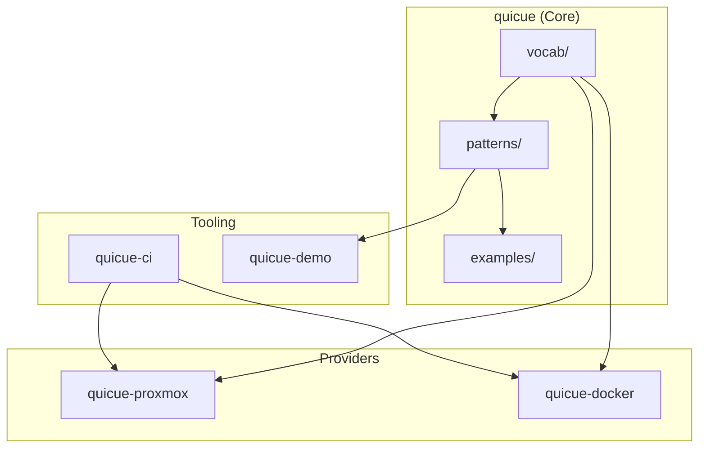
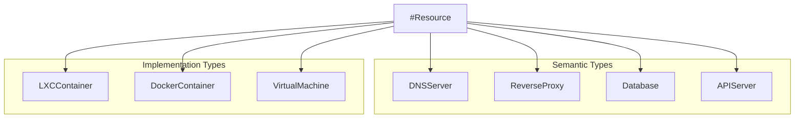
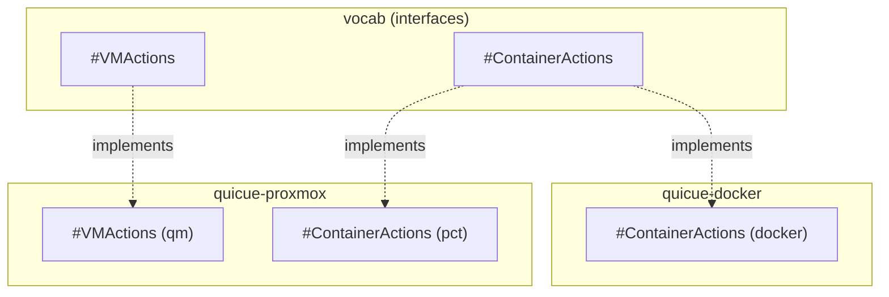

# Quicue Architecture

## Overview

Quicue models infrastructure as a graph where resources are nodes and dependencies are edges. CUE's constraint system validates the graph at compile time.

## Component Diagram



## Data Flow

```mermaid
flowchart LR
    A[Define Resources] --> B[#InfraGraph]
    B --> C{Computed Properties}
    C --> D[topology]
    C --> E[roots/leaves]
    C --> F[_ancestors]
    C --> G[dependents]

    F --> H[#ImpactQuery]
    G --> I[O(1) lookups]
    D --> J[#DeploymentPlan]
```

## Core Modules

### vocab/
Base schemas and type registry.

| File | Purpose |
|------|---------|
| `resource.cue` | `#Resource` - base schema for all resources |
| `actions.cue` | `#Action` - schema for executable actions |
| `types.cue` | `#TypeRegistry` - semantic type catalog |
| `context.cue` | JSON-LD `@context` for semantic export |

### patterns/
Graph algorithms and query patterns.

| Pattern | Purpose |
|---------|---------|
| `#InfraGraph` | Convert resources to traversable graph |
| `#ImpactQuery` | What breaks if X fails |
| `#CriticalityRank` | Rank by dependent count |
| `#DeploymentPlan` | Layer-by-layer startup/shutdown |
| `#BlastRadius` | Change impact analysis |
| `#HealthStatus` | Status propagation |
| `#ValidateGraph` | Structural validation |

## Type System



Resources can have multiple types via `@type`:
```cue
"dns-server": {
    "@type": {DNSServer: true, LXCContainer: true}
}
```

## Provider Architecture

Providers implement platform-specific actions for interfaces defined in vocab.



## Graph Computation

#InfraGraph computes these properties for each resource:

| Property | Description | Complexity |
|----------|-------------|------------|
| `_depth` | Distance from root | O(n) |
| `_ancestors` | Transitive dependencies | O(n) per resource |
| `_path` | Path to root | O(depth) |
| `dependents` | What depends on this | O(n^2) total, O(1) lookup |

## Performance Characteristics

| Operation | Time | Notes |
|-----------|------|-------|
| Validation | <0.5s | No transitive closure |
| Topology | <0.5s | Single pass |
| Impact query | O(1) | Pre-computed dependents |
| Full graph (1000 nodes) | 1-5s | Shape dependent |
